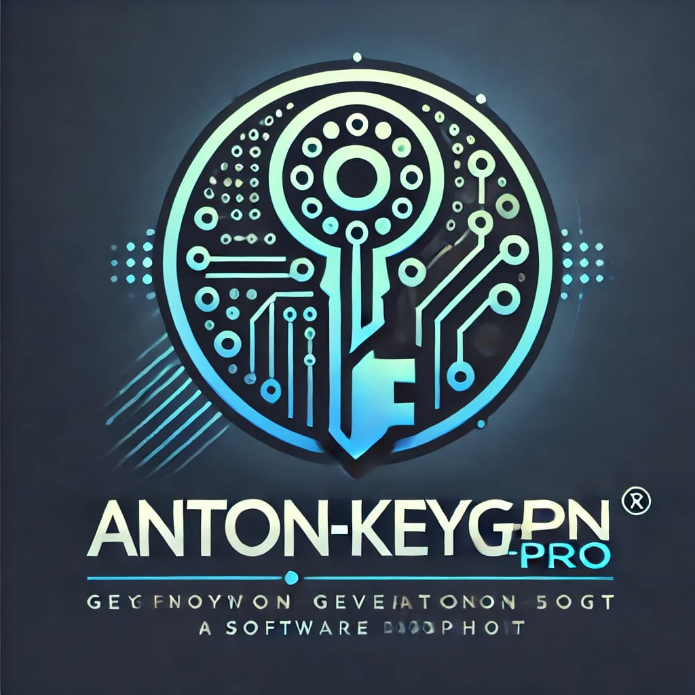

<h1 align="center">
	<br>
	<br>
	
	<br>
	<br>
	<br>
</h1>


# Anton KeyGen Pro 🔑

**Anton KeyGen Pro** adalah utilitas yang kuat untuk menghasilkan kunci acak dengan format tersegmentasi yang dapat disesuaikan. Proyek ini dirancang untuk membantu pengembang dalam membuat pengenal unik, kunci lisensi, atau kode untuk aplikasi mereka.

## Penjelasan Proyek: AntonKeyGen

AntonKeyGen adalah utilitas yang dirancang untuk menghasilkan kunci acak dengan format tersegmentasi, memungkinkan pengembang untuk membuat pengenal unik yang dapat digunakan untuk berbagai aplikasi, seperti lisensi perangkat lunak, identifikasi pengguna, atau kunci akses. Kunci yang dihasilkan terdiri dari kombinasi huruf kapital dan angka, yang menjamin keunikan dan keamanan.

Berikut adalah contoh kunci yang dihasilkan oleh AntonKeyGen:

- **Contoh dari AntonKeyGen**: `MBIZ-FPMC-V5S4-PVHG`  
  Kunci ini terdiri dari empat segmen, masing-masing dengan empat karakter, dan dipisahkan oleh tanda hubung.

- **Contoh dari AntonKeyGen2**: `HMQO-AATN-JSKT-GMQJ`  
  Kunci ini juga mengikuti format yang sama, memberikan kombinasi yang berbeda dan unik.

- **Contoh dari AntonKeyGen3**: `4821-5824-5583-1135`  
  Kunci ini menunjukkan penggunaan angka dalam format tersegmentasi yang memudahkan pembacaan dan penggunaan.

- **Contoh dari AntonKeyGen4**: `JW3K-98TW-6V37`  
  Kunci ini menampilkan campuran huruf dan angka dengan segmentasi yang jelas, menjadikannya mudah diingat.

- **Contoh dari AntonKeyGen5**: `TYXD-GKDM-QIAM`  
  Kunci ini memberikan kombinasi unik yang dapat digunakan untuk tujuan khusus seperti pengenal produk.

- **Contoh dari AntonKeyGen6**: `3307-6584-2503`  
  Kunci ini berfokus pada penggunaan angka, menjadikannya ideal untuk aplikasi yang memerlukan format numerik.

Dengan kemampuan untuk menghasilkan kunci dalam berbagai format, **AntonKeyGen** menawarkan fleksibilitas dan keamanan yang tinggi, memungkinkan pengguna untuk menyesuaikan kunci sesuai dengan kebutuhan spesifik aplikasi mereka.

## Fitur

- **Kunci Acak**: Menghasilkan kunci yang sepenuhnya acak yang terdiri dari huruf kapital dan angka, memastikan keunikan di setiap instance. Ini sangat berguna untuk keperluan seperti pengenal pengguna atau kunci lisensi.

- **Format Tersegmentasi**: Kunci yang dihasilkan akan diformat dalam struktur yang tersegmentasi, dibagi menjadi empat segmen (misalnya, `ABCD-1234-EFGH-5678`) dengan setiap segmen berisi 4 karakter. Format ini membuat kunci lebih mudah dibaca dan digunakan.

- **Konversi ke Huruf Kecil**: Kunci yang dihasilkan dikembalikan dalam format huruf kecil, menjamin konsistensi gaya dan memudahkan integrasi ke dalam sistem yang memerlukan input huruf kecil.

- **Keamanan Kriptografis**: Menggunakan modul `crypto` dari Node.js untuk menghasilkan byte acak yang aman, memastikan tingkat keacakan yang tinggi dan mengurangi kemungkinan prediksi kunci.

- **Kustomisasi**: Mudah diperluas untuk memodifikasi panjang segmen, jumlah segmen, atau set karakter yang digunakan, memberikan fleksibilitas kepada pengembang untuk menyesuaikan kunci sesuai kebutuhan aplikasi mereka.

## Instalasi

Untuk menginstal paket ini, gunakan npm dengan perintah berikut:

```bash
npm install anton-keygen-pro
```
## contoh pengguna

```javascript
const {
 AntonKeyGen, 
 AntonKeyGen2, 
 AntonKeyGen3, 
 AntonKeyGen4,
 AntonKeyGen5,
 AntonKeyGen6
} = require('anton-keygen-pro');

(async () => {
    const generatedKey = await AntonKeyGen();
    const generatedKey2 = await AntonKeyGen2();
    const generatedKey3 = await AntonKeyGen3();
    const generatedKey4 = await AntonKeyGen4();
    const generatedKey5 = await AntonKeyGen5();
    const generatedKey6 = await AntonKeyGen6();
    console.log("Contoh dari AntonKeyGen:", generatedKey);
    console.log("Contoh dari AntonKeyGen2:", generatedKey2);
    console.log("Contoh dari AntonKeyGen3:", generatedKey3);
    console.log("Contoh dari AntonKeyGen4:", generatedKey4);
    console.log("Contoh dari AntonKeyGen5:", generatedKey5);
    console.log("Contoh dari AntonKeyGen6:", generatedKey6);
})();
```

## Hashtags

```Hashtags
#KeyGenerator 
#RandomKey 
#LicenseKey 
#UniqueID 
#SecureKeys 
#NodeJS 
#Cryptography 
#SecureRandom 
#APIKeys 
#PasswordGenerator 
#NPMModule 
#SoftwareSecurity 
#KeyManagement 
#SecureTokens 
#OpenSource
